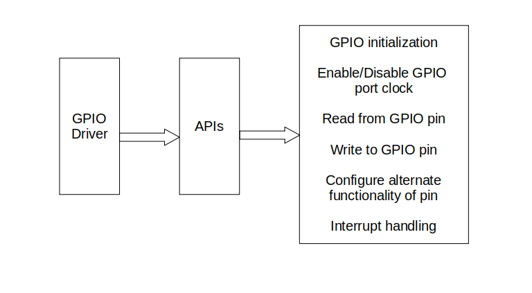
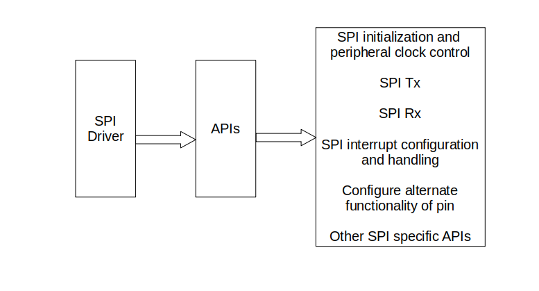

# STM32f413xx-drivers-from-scratch

The drivers for the following peripherals in any STM32F413XX are implemented:\
1.) GPIOx (x = A, B, C, D, E, F, G, H)\
2.) SPIx (x = 1, 2, 3, 4)\
3.) I2Cx (x = 1, 2, 3)\
4.) USARTx (x = 1, 2, 3, 6)\
5.) UARTx (x = 4, 5, 7, 8, 9, 10)

file:///home/rohitimandi/Desktop/Rohit/Personal/Online%20Project%20Uploads/Github/Embedded%20Systems/STM32f413xx-drivers-from-scratch/uml-images/Drivers.png

---
Th MCU header file usr_stm32f413xx.h at ./drivers/inc/ contains:\
1.) Base addresses of flash, SRAM1, ROM, peripheral buses and the various peripherals\
2.) Peripheral register definition structure and peripheral definitions\
3.) System clock and peripheral clock enable/disable\
4.) Peripheral interrupt position number in the vector table\
5.) Bit positions of various registers for all peripherals

The header file for peripheral driver implementation at ./drivers/inc/ contains:\
1.) Peripheral handle structure\
2.) Peripheral configuration structure\
3.) API prototypes\
4.) And macros for various modes that need to be configured

The drivers were tested on STM32F413ZH Nucleo-144 containing ARM Cortex M4 and the communication protocols were tested with an Arduino Uno Rev3.

---

The reference manual RM0430 for ARM cortex M4 can be found <a href="https://www.st.com/en/microcontrollers-microprocessors/stm32f413zh.html#documentation)https://www.st.com/en/microcontrollers-microprocessors/stm32f413zh.html#documentation">here</a>. \
The links to datasheet and usermanual of the board can be found <a href="https://community.element14.com/products/devtools/product-pages/w/documents/22502/stm32-nucleo-144-development-board-with-stm32f413zh-mcu">here</a>.

I couldn't find all the documents on the board's product page at ST's official website.
